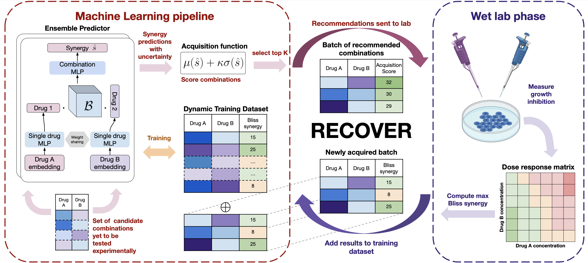

# RECOVER: sequential model optimization platform for combination drug repurposing identifies novel synergistic compounds *in vitro*

RECOVER coalition (Mila, Relation Therapeutics)

This Recover repository is based on research funded by (or in part by) the Bill & Melinda Gates Foundation. The 
findings and conclusions contained within are those of the authors and do not necessarily reflect positions or policies 
of the Bill & Melinda Gates Foundation.

## Abstract

Selecting optimal drug repurposing combinations for further preclinical development is a challenging technical feat. 
Due to the toxicity of many therapeutic agents (e.g., chemotherapy), practitioners have favoured selection of 
synergistic compounds whereby lower doses can be used whilst maintaining high efficacy. For a fixed small molecule 
library, an exhaustive combinatorial chemical screen becomes infeasible to perform for academic and industry 
laboratories alike. Deep learning models have achieved state-of-the-art results *in silico* for the prediction 
of synergy scores. However, databases of drug combinations are highly biased towards synergistic agents and these 
results do not necessarily generalise out of distribution. We employ a sequential model optimization search applied to 
a deep learning model to quickly discover highly synergistic drug combinations active against a cancer cell line, 
while requiring substantially less screening than an exhaustive evaluation. Through iteratively adapting the model to 
newly acquired data, after only 3 rounds of ML-guided experimentation (including a calibration round), we find that 
the set of combinations queried by our model is enriched for highly synergistic combinations. Remarkably, we 
rediscovered a synergistic drug combination that was later confirmed to be under study within clinical trials.

## Environment setup

**Requirements**: Anaconda (https://www.anaconda.com/) and Git LFS (https://git-lfs.github.com/). Please make sure 
both are installed on the system prior to running installation.

**Installation**: enter the command `source install.sh` and follow the instructions. This will create a conda 
environment named **recover** and install all the required package including the 
[recover_data_lake](https://github.com/RECOVERcoalition/Recover-Data-Lake) package that stores the primary data acquisition scripts.

## Running the pipeline

Configuration files for our experiments are provided in the following directory: `Recover/recover/config`

To run the pipeline with a custom configuration:
- Create your configuration file and move it to `Recover/recover/config/`
- Run `python train.py --config <my_configuration_file>`

Note that `<my_configuration_file>` should not include *.py*. For example, to run the pipeline with configuration from 
the file `model_evaluation.py`, run `python train.py --config model_evaluation`

